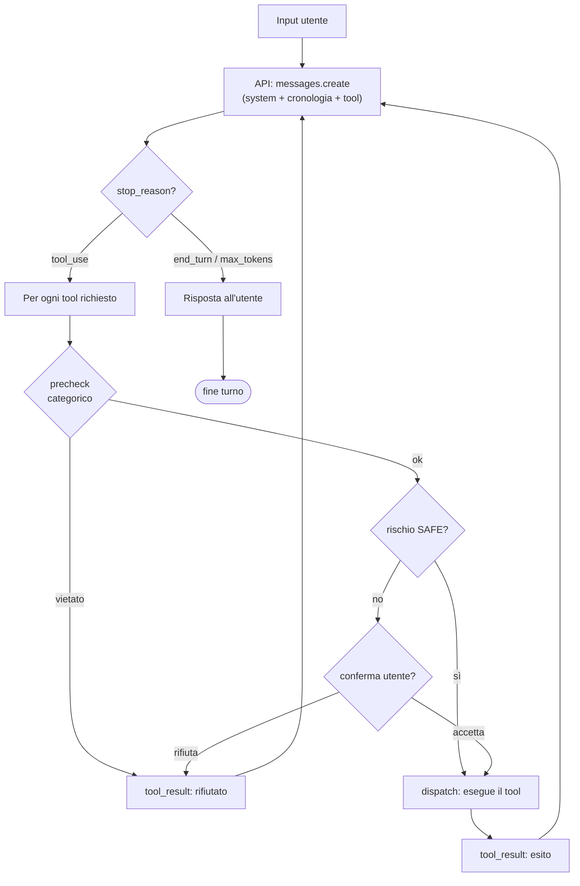

# Jarvis

Assistente AI **locale** in Python: conversa in italiano e compie azioni **reali** sul
tuo computer tramite *strumenti* (tool), con un **loop agentico** — il modello DECIDE,
il codice ESEGUE. Usa l'API Anthropic (`claude-sonnet-4-6`).

> Progetto costruito a fasi, con un occhio didattico. Lo stato di ciascuna fase è in
> [`PIANO.md`](PIANO.md).

---

## Cos'è

Jarvis è un piccolo agente che gira sul tuo computer. Gli scrivi in linguaggio naturale;
lui, quando serve, non risponde "a memoria" ma **usa un tool** che compie un'azione vera
(legge un file, esegue un comando, cerca sul web, ricorda un fatto…), ne osserva il
risultato e continua, per più giri, finché non ha la risposta. Le azioni che modificano
il sistema o i file **chiedono conferma** prima di partire.

## Requisiti

- **Python 3.10 o superiore** (il codice usa la sintassi dei tipi `X | None`).
- Una **chiave API Anthropic** (variabile `ANTHROPIC_API_KEY`).
- Dipendenze: **solo** `anthropic`, `rich`, `python-dotenv`. Tutto il resto è libreria
  standard di Python (vincolo di progetto: niente dipendenze pesanti).

## Installazione e avvio

```bash
# 1. (consigliato) crea e attiva un ambiente virtuale
python -m venv .venv
source .venv/bin/activate        # su Windows: .venv\Scripts\activate

# 2. installa le dipendenze
pip install -r requirements.txt

# 3. crea il tuo file .env dalla copia d'esempio e inserisci la chiave
cp .env.example .env
#   poi apri .env e metti la tua ANTHROPIC_API_KEY

# 4. avvia
python main.py
```

Scrivi `esci` (oppure `exit`/`quit`, o premi Ctrl-C) per terminare.

> Verifica rapida senza chiave né rete: `python smoke_test.py` (vedi
> [Verifica rapida](#verifica-rapida-smoke-test)).

## Architettura

La regola dell'architettura è la **separazione dei ruoli**: il "cervello" non sa nulla
dell'interfaccia, e l'unica parte che stampa è la REPL.

| File / cartella | Ruolo |
|---|---|
| `main.py` | La **REPL**: legge l'input, chiama l'agente, stampa (con `rich`). È l'unico file che scrive a schermo. |
| `brain.py` | Il **loop agentico GENERICO**: tiene la cronologia, chiama l'API, esegue i tool richiesti e rimanda i risultati al modello; gestisce robustezza e compattazione. |
| `safety.py` | **Sicurezza**: livelli di rischio, conferma, sandbox dei file, blacklist della shell, guardiano anti-SSRF per il web. |
| `memory.py` | **Memoria lunga**: fatti persistenti su SQLite. |
| `history.py` | **Memoria breve**: compattazione (riassunto) della cronologia quando cresce troppo. |
| `logger.py` | **Osservabilità**: traccia ogni tool call su file JSONL. |
| `tools/` | Le **famiglie di tool** (`system`, `files`, `shell`, `web`, `memory`), aggregate per `brain.py`. |

### Il loop agentico

Il cuore di Jarvis. Il modello **decide** se e quale tool usare; il nostro codice lo
**esegue** (dopo i controlli di sicurezza) e gli rimanda il risultato, ripetendo finché
il modello non ha una risposta pronta.



Ogni `tool_result` rientra nell'API: è questo che chiude il ciclo. A fine turno, se la
cronologia è troppo lunga, viene **compattata**; se una chiamata all'API fallisce, il
turno degrada con grazia senza far morire la REPL e **senza lasciare la cronologia
spezzata** (vedi [Robustezza](#robustezza-fase-7b)).

## Gli strumenti (tool)

Ogni tool ha un **livello di rischio**: `SAFE` (esegue subito), `CAUTION`/`DANGEROUS`
(chiede conferma prima di agire).

| Famiglia | Tool | Rischio |
|---|---|---|
| **Sistema** | `get_system_info`, `elenca_processi` | SAFE |
| | `apri_applicazione`, `screenshot` | CAUTION |
| | `chiudi_processo` | DANGEROUS |
| **File** | `leggi_file`, `lista_dir`, `cerca_per_nome`, `cerca_nel_contenuto` | SAFE |
| | `scrivi_file`, `sposta`, `crea_cartella` | CAUTION |
| **Shell** | `esegui_comando` | DANGEROUS |
| **Web** | `leggi_pagina` | CAUTION |
| | `web_search` (eseguito dai server Anthropic) | — |
| **Memoria** | `ricorda`, `richiama` | SAFE |

## Sicurezza e sandbox

- **Conferma esplicita** prima di ogni azione non-`SAFE`: se rifiuti, Jarvis lo sa e può
  proporre un'alternativa.
- **Sandbox dei file**: le operazioni su file sono confinate a una cartella sicura
  (`JARVIS_SANDBOX`, default `~/Jarvis-Sandbox`); i percorsi al suo esterno vengono
  rifiutati — ed è normale.
- **Blacklist della shell**: alcuni comandi distruttivi sono **sempre** vietati, prima
  ancora della conferma.
- **Web anti-SSRF**: `leggi_pagina` accetta solo http/https e blocca gli indirizzi locali
  e di rete privata; non esegue JavaScript.

Jarvis non finge mai di aver eseguito un'azione: l'errore di un tool torna al modello come
osservazione, così può correggersi.

## Memoria

- **Lunga** (`memory.py`): fatti persistenti su SQLite. `ricorda` salva un fatto durevole,
  `richiama` lo ritrova (ricerca per parole chiave, non semantica). I fatti più recenti
  sono **iniettati** nel system prompt a ogni turno (un RAG semplificato). File in
  `JARVIS_MEMORY` (default `~/Jarvis-Sandbox/jarvis_memory.db`).
- **Breve** (`history.py`): quando la cronologia della conversazione supera
  `JARVIS_MAX_TOKENS` (default 40000), la parte più vecchia viene **riassunta** (con
  troncamento come ripiego), tagliando solo su confini sicuri per non spezzare mai una
  coppia `tool_use`/`tool_result`.

## Osservabilità (log)

`logger.py` scrive **ogni** tool call su un file JSONL (`JARVIS_LOG`, default
`~/Jarvis-Sandbox/jarvis.jsonl`): quando, quale tool, input, output (troncato), esito
(`ok`/`errore`/`rifiutato`), durata e rischio. Utile per capire cosa ha fatto Jarvis e per
il debug. Non blocca mai l'assistente: se il file non è scrivibile, avvisa una volta e
prosegue.

## Robustezza (Fase 7b)

Le chiamate all'API sono resistenti ai guasti:

- **Retry** automatico degli errori *transitori* (rete/timeout, `429`, `5xx`/`529`): è
  quello **nativo** dell'SDK, solo configurato — `JARVIS_API_RETRIES` (default 4) e,
  opzionale, `JARVIS_API_TIMEOUT`.
- **Errori permanenti** (es. `401` chiave errata) → messaggio chiaro, nessun retry inutile.
- **Graceful degradation**: se una chiamata fallisce comunque, la REPL **non muore**;
  ricevi un messaggio leggibile e la cronologia resta **coerente** per il turno successivo.

## Variabili d'ambiente

| Variabile | A cosa serve | Default |
|---|---|---|
| `ANTHROPIC_API_KEY` | Chiave API Anthropic (**obbligatoria**) | — |
| `JARVIS_SANDBOX` | Cartella sicura per le operazioni sui file | `~/Jarvis-Sandbox` |
| `JARVIS_MEMORY` | File SQLite della memoria lunga | `~/Jarvis-Sandbox/jarvis_memory.db` |
| `JARVIS_MAX_TOKENS` | Soglia token oltre cui compattare la cronologia | `40000` |
| `JARVIS_LOG` | File JSONL delle tool call | `~/Jarvis-Sandbox/jarvis.jsonl` |
| `JARVIS_API_RETRIES` | Ritentativi SDK sugli errori transitori (≥ 0) | `4` |
| `JARVIS_API_TIMEOUT` | Timeout in secondi sulla richiesta API (> 0) | default SDK |
| `JARVIS_VOICE` | Attiva la modalità voce (Fase 6, opzionale) | disattivata |
| `JARVIS_TTS` | Motore TTS della voce: `say` (macOS), `piper`, o `auto` | `auto` (→ `say` su macOS) |
| `JARVIS_SAY_VOICE` | Voce del comando `say` su macOS (es. `Alice`, `Luca`) | voce di sistema |
| `JARVIS_PIPER_MODEL` | Percorso del modello voce piper (.onnx) per il TTS | nome di comodo (da impostare) |
| `JARVIS_VAD` | Rilevazione del silenzio nell'ascolto (`0` = finestra fissa) | attiva |
| `JARVIS_VAD_SOGLIA` | Sensibilità del VAD (energia RMS): più alta = meno sensibile | `0.015` |

Tutte le opzionali sono documentate anche in [`.env.example`](.env.example).

## Esempi

Tre interazioni che mostrano sottosistemi diversi. Richiedono una `ANTHROPIC_API_KEY`
valida e rete: **provale in locale** dopo l'avvio (`python main.py`).

**1. Sistema (sola lettura, nessuna conferma)**

```
Tu > che sistema operativo uso e quanto spazio ho libero sul disco?
🔧 uso get_system_info({})
Jarvis > Stai usando Linux … e hai … GB liberi sul disco.
```

**2. File nella sandbox (azione con conferma)**

```
Tu > scrivi un file promemoria.txt nella sandbox con dentro "comprare il latte"
🔧 uso scrivi_file({'percorso': 'promemoria.txt', 'contenuto': 'comprare il latte'})
   → Jarvis chiede conferma perché scrivi_file è CAUTION; digita "s" per accettare
Jarvis > Fatto: ho creato promemoria.txt nella sandbox.
```

**3. Memoria persistente (ricorda + richiama)**

```
Tu > ricorda che tengo i miei progetti in ~/Sviluppo
🔧 uso ricorda({'fatto': 'I progetti dell’utente sono in ~/Sviluppo'})
Jarvis > Segnato.

Tu > dove tengo i progetti?
Jarvis > Nella cartella ~/Sviluppo.
```

*(Il testo esatto delle risposte varia: è il modello a formularle.)* Esiste anche la
**ricerca web** (`web_search`): usa la rete e ha un piccolo costo per ricerca, quindi non
è tra gli esempi di base.

## Voce (opzionale, Fase 6)

Jarvis può funzionare **a voce**: microfono → riconoscimento vocale (STT) → il solito loop
→ sintesi vocale (TTS) → altoparlante. È un **guscio** attorno allo stesso cervello
(`voice.py`): il loop non cambia.

È **opzionale e disattivata di default**, perché richiede dipendenze pesanti e hardware
audio. Il core resta a 3 dipendenze.

L'**ingresso** (microfono → testo) usa sempre `faster-whisper` + `sounddevice`. L'**uscita**
(testo → voce, TTS) ha invece **due motori**, scelti automaticamente o via `JARVIS_TTS`:

- **`say` (macOS)** — il sintetizzatore **integrato** in macOS: nessun binario esterno né
  modello da scaricare, nativo Apple Silicon, zero grattacapi. **È il default sul Mac.**
- **`piper`** — TTS neurale locale multipiattaforma (binario esterno + modello voce `.onnx`).
  Il default fuori da macOS, o se imposti `JARVIS_TTS=piper`.

**Setup comune (STT, sempre):**

```bash
pip install -r requirements-voice.txt
```

**Su macOS (consigliato, con `say`):** non serve altro. Opzionale: scegli una voce italiana.

```bash
# (opzionale) elenca le voci disponibili e installane una italiana da
# Impostazioni di Sistema › Accessibilità › Contenuti pronunciati › Voce di sistema
say -v '?' | grep it_IT           # es. Alice, Luca
export JARVIS_SAY_VOICE=Alice     # senza questa, usa la voce di sistema

python main.py --voce             # oppure:  JARVIS_VOICE=1 python main.py
```

**Con piper (Linux, o macOS se preferisci il TTS neurale):**

```bash
# il programma piper + un modello voce .onnx: vedi https://github.com/rhasspy/piper
#   scarica il modello e il suo file .onnx.json accanto (stesso nome base)
#   su Linux serve anche espeak-ng (es. `sudo apt-get install espeak-ng`)
export JARVIS_PIPER_MODEL=/percorso/a/it_IT-riccardo-x_low.onnx   # percorso ESATTO, .onnx incluso
export JARVIS_TTS=piper          # solo se vuoi forzare piper su un Mac
python main.py --voce
```

Di' **«esci»** per terminare. Se le dipendenze audio mancano, Jarvis te lo dice e
**ripiega automaticamente sulla modalità testo**.

L'ascolto usa una **rilevazione del silenzio** (VAD "a energia"): Jarvis smette di
registrare quando smetti di parlare, invece di una finestra fissa. Se il microfono è
rumoroso e parte da solo (o al contrario non ti sente), regola la sensibilità con
`JARVIS_VAD_SOGLIA` (alzala se è troppo sensibile, abbassala se non ti sente); puoi
tornare alla finestra fissa con `JARVIS_VAD=0`.

> **Stato**: il flusso è testato (mock del ciclo + logica VAD pura) e su macOS funziona
> end-to-end con `say`. Con piper i backend audio vanno **collaudati in locale** (servono
> microfono/altoparlanti e il binario piper). Limite residuo: la conferma delle azioni
> CAUTION/DANGEROUS passa ancora dalla **tastiera** anche in modalità voce.

## Verifica rapida (smoke-test)

Per un controllo veloce **senza chiave API e senza rete**:

```bash
python smoke_test.py
```

Verifica *a secco* che l'app si importi, che il registro dei tool sia ben formato e che un
tool `SAFE` giri in isolamento. **Non** sostituisce la prova end-to-end degli
[esempi](#esempi), che richiede la chiave e la rete.

## Limiti noti

- **Voce** (Fase 6): scheletro pronto e testato nel flusso non-audio (vedi
  [Voce](#voce-opzionale-fase-6)); i backend audio reali vanno collaudati in locale
  (servono hardware audio e dipendenze pesanti).
- Il **richiamo** della memoria è per parole chiave, non semantico (non capisce i sinonimi).
- Alcune azioni (processi, screenshot, apertura app) usano gli **strumenti nativi del
  sistema operativo**: se su un dato SO manca lo strumento, Jarvis lo dice con un errore
  chiaro invece di fingere.
- **Costi**: ogni chiamata all'API — e in particolare `web_search` — ha un costo.
