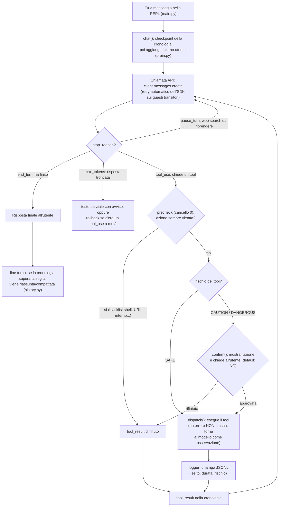

# Jarvis

Assistente AI personale che gira sul tuo computer: conversa in italiano e compie
azioni **reali** — file, sistema, shell, web, memoria — tramite un *loop agentico*:
**il modello DECIDE, il codice ESEGUE**. Ogni azione rischiosa passa da cancelli di
sicurezza espliciti, ogni tool call è tracciata, ogni errore è dichiarato (mai un
finto successo).

Il "cervello" è il modello `claude-sonnet-4-6` via API Anthropic (serve una chiave);
i tool girano in locale, sul tuo computer. È un progetto didattico costruito a fasi:
la storia, le convenzioni e lo stato dei lavori sono in [PIANO.md](PIANO.md).

## Requisiti

- **Python 3.10 o superiore** (il codice usa la sintassi dei tipi `X | None`;
  sviluppato e provato con Python 3.11).
- **Una chiave API Anthropic** (`ANTHROPIC_API_KEY`), creata su
  [console.anthropic.com](https://console.anthropic.com). L'uso dell'API è a
  pagamento: una conversazione costa centesimi, ma non è gratis.
- **Connessione a Internet** per parlare con l'API (i tool girano in locale, ma il
  modello è remoto).
- Tre dipendenze, elencate in `requirements.txt`: `anthropic` (SDK ufficiale),
  `rich` (output colorato nel terminale), `python-dotenv` (lettura del file `.env`).
  Tutto il resto è libreria standard, per scelta di progetto.

> Nota: la memoria lunga usa SQLite (incluso in Python). Se il tuo Python ha SQLite
> senza l'estensione FTS5, la ricerca tra i fatti ripiega automaticamente su un
> confronto `LIKE` più semplice — e lo dichiara, senza fingere.

## Setup

```bash
git clone <URL-del-repo> jarvis && cd jarvis

# (consigliato) ambiente virtuale
python -m venv .venv
source .venv/bin/activate            # su Windows: .venv\Scripts\activate

pip install -r requirements.txt

# configurazione: copia l'esempio e inserisci la TUA chiave
cp .env.example .env                 # su Windows: copy .env.example .env
# apri .env con un editor e valorizza ANTHROPIC_API_KEY

python main.py
```

Per uscire: scrivi `esci` (oppure `exit`/`quit`, o premi Ctrl-C).

Senza chiave l'app **parte comunque**, ma al primo messaggio ottieni un errore
chiaro dell'SDK ("Could not resolve authentication method…") e la sessione resta
viva; con una chiave sbagliata ricevi il messaggio mirato dell'errore 401. Tutte le
altre variabili di configurazione sono opzionali e documentate
[più sotto](#variabili-dambiente).

### Verifica a secco (senza chiave, senza rete)

```bash
python smoke_test.py
```

Controlla ciò che si può controllare **senza** chiave API: gli import reggono, il
registro dei tool è integro, i cancelli di sicurezza bloccano ciò che devono
bloccare, i tool SAFE (file, sistema, memoria, log) funzionano in isolamento su
cartelle temporanee. Esce con codice 0 se tutto passa. Quello che NON copre — il
loop agentico completo, con il modello che decide — è esattamente ciò che mostrano
gli esempi qui sotto, da provare in locale con la chiave.

## Esempi

Nota onesta: le trascrizioni sono l'esito **atteso** — la forma esatta delle
risposte varia da esecuzione a esecuzione (è un modello, non uno script). Quello che
è stabile, ed è garantito dal codice, è il comportamento dei tool e dei cancelli:
quali tool vengono usati, quando scatta la conferma, cosa finisce su disco. Per
riprodurle servono una `ANTHROPIC_API_KEY` reale e la rete.

### 1 — Sistema (sola lettura, nessuna conferma)

```text
Tu > quanto spazio ho sul disco?
🔧 uso get_system_info({})
Jarvis > Hai 412,3 GB liberi su 931,5 GB totali (519,2 GB usati).
```

`get_system_info` è SAFE (sola lettura): il loop lo esegue senza chiedere conferma.
La riga `🔧` è la trasparenza della REPL: mostra ogni tool che Jarvis usa, con i
suoi argomenti.

### 2 — File, con cancello di conferma

```text
Tu > crea un file promemoria.txt con scritto "comprare il latte"
🔧 uso scrivi_file({'percorso': 'promemoria.txt', 'contenuto': 'comprare il latte'})

⚠  Jarvis vuole eseguire un'azione [CAUTION]
   tool: scrivi_file
   percorso: promemoria.txt
   contenuto: comprare il latte
Confermi? [s/N] s
Jarvis > Fatto: ho scritto "comprare il latte" in promemoria.txt.
```

`scrivi_file` è CAUTION (modifica il disco): prima di eseguire, il loop mostra
**esattamente** cosa sta per succedere e chiede conferma. Il default è NO — premere
solo Invio equivale a rifiutare — e il rifiuto torna al modello come osservazione
(proporrà un'alternativa invece di insistere). Il file finisce nella **sandbox**
(`~/Jarvis-Sandbox/promemoria.txt` di default): percorsi fuori dalla sandbox vengono
rifiutati alla radice.

### 3 — Memoria persistente, in due turni

```text
Tu > ricorda che tengo i miei progetti in ~/Sviluppo
🔧 uso ricorda({'fatto': "L'utente tiene i suoi progetti nella cartella ~/Sviluppo"})
Jarvis > Segnato: i tuoi progetti sono in ~/Sviluppo.

Tu > dove tengo i progetti?
Jarvis > Nella cartella ~/Sviluppo.
```

`ricorda` salva il fatto su SQLite, **persistente tra le sessioni**: il secondo
turno funziona anche se nel frattempo chiudi e riavvii Jarvis. Spesso al secondo
turno non serve nemmeno un tool: i fatti più recenti sono già iniettati nel system
prompt a ogni turno; per il resto il modello usa `richiama` (ricerca per parole
chiave, non semantica).

### (Facoltativo) Ricerca web

"Cerca le ultime notizie su…" attiva la ricerca online (`web_search`), eseguita dai
server di Anthropic (max 5 ricerche per turno); la query compare nella riga `🔧` per
trasparenza. Ha un piccolo costo aggiuntivo per ogni ricerca — per questo non è tra
gli esempi "da provare subito".

## Architettura

| File | Ruolo |
|------|------|
| `main.py` | La REPL: legge l'input, stampa risposte e note. È l'**unico** file di interfaccia (stampano, oltre a lui, solo i cancelli di conferma e gli avvisi di `safety.py`/`logger.py`). |
| `brain.py` | Il cervello: la classe `Agent` con il loop agentico **generico** (`chat()`, `_loop_agentico`, compattazione a fine turno). Non conosce i singoli tool. |
| `safety.py` | Il guardiano: livelli di rischio, sandbox dei file, blacklist della shell, conferma esplicita, guardiano anti-SSRF per il web. |
| `memory.py` | Memoria LUNGA: fatti persistenti su SQLite (FTS5, con ripiego `LIKE` onesto). |
| `history.py` | Memoria BREVE: decide se e dove compattare la cronologia della conversazione. |
| `logger.py` | Osservabilità: ogni tool call su file JSONL, in append. |
| `tools/` | Le famiglie di tool (`files`, `system`, `shell`, `web`, `memory`); `tools/__init__.py` le aggrega nel registro usato dal loop. |

La regola architetturale: `brain.py` riceve dal registro gli schemi e la funzione di
dispatch, e non sa altro. Aggiungere un tool nuovo significa toccare **solo**
`tools/` — il loop, la sicurezza, il log e la memoria lo servono gratis.

### Il loop agentico



In prosa: il modello non esegue mai nulla da solo — emette *richieste* di tool, e il
nostro codice le esegue solo dopo i cancelli (precheck e conferma). Tutti gli esiti,
**compresi rifiuti ed errori**, tornano al modello come `tool_result` (e finiscono
nel log, anche i rifiuti): così può correggersi o proporre alternative invece di
fingere. Il ciclo può fare più giri nello stesso turno (tool → risultato → altro
tool → …) finché il modello non ha la risposta. Se qualcosa va storto a metà turno
— API giù, conferma interrotta, risposta troncata su un tool — il *checkpoint* di
`chat()` ripristina la cronologia com'era a inizio turno, così la conversazione
riparte sempre da uno stato coerente.

## I tool disponibili

| Famiglia | Tool | Rischio | Note |
|----------|------|---------|------|
| Sistema | `get_system_info`, `elenca_processi` | SAFE | sola lettura |
| Sistema | `apri_applicazione`, `screenshot` | CAUTION | con conferma; lo screenshot è salvato nella sandbox |
| Sistema | `chiudi_processo` | DANGEROUS | con conferma |
| File | `leggi_file`, `lista_dir`, `cerca_per_nome`, `cerca_nel_contenuto` | SAFE | sola lettura, confinati in sandbox |
| File | `scrivi_file`, `sposta`, `crea_cartella` | CAUTION | con conferma, confinati in sandbox |
| Shell | `esegui_comando` | DANGEROUS | blacklist + conferma sempre; directory di lavoro = sandbox |
| Web | `leggi_pagina` | CAUTION | GET in sola lettura con guardiano anti-SSRF; non esegue JavaScript |
| Web | `web_search` | server-side | eseguito da Anthropic (max 5 per turno); non passa dalla conferma, la query è mostrata a schermo |
| Memoria | `ricorda`, `richiama` | SAFE | toccano solo il DB locale di Jarvis |

## Sicurezza e sandbox

- **Tre livelli di rischio.** SAFE (sola lettura locale) viene eseguito subito;
  CAUTION e DANGEROUS passano da `confirm()`, che mostra tool e argomenti esatti e
  chiede conferma esplicita. Il default è **NO**: una risposta vuota rifiuta.
- **Cancello 0 (precheck).** Ciò che è *sempre* vietato viene respinto prima ancora
  della conferma: la blacklist della shell (`sudo`, `rm -rf /`, `mkfs`, fork bomb,
  spegnimento…) e gli URL verso reti interne.
- **Sandbox dei file.** Ogni tool file risolve il percorso (compresi `..` e symlink)
  e rifiuta tutto ciò che esce da `JARVIS_SANDBOX` (default `~/Jarvis-Sandbox`).
- **Attenzione, onestamente:** la sandbox confina i *tool file*. `esegui_comando` ha
  la directory di lavoro nella sandbox ma un comando shell può toccare altri
  percorsi: per questo è DANGEROUS, con blacklist e conferma **sempre**.
- **Anti-SSRF.** `leggi_pagina` accetta solo `http`/`https` e risolve l'host prima
  della richiesta: localhost, reti private e l'endpoint metadata dei cloud
  (`169.254.169.254`) sono bloccati.

## Memoria

- **Lunga** (`memory.py`): fatti persistenti su SQLite (`ricorda`/`richiama`). I
  fatti più recenti vengono iniettati nel system prompt a ogni turno; il resto si
  recupera on-demand con `richiama` (FTS5 per parole chiave, con ripiego `LIKE`). È
  un RAG semplificato: iniezione + richiamo, niente embedding.
- **Breve** (`history.py`): la cronologia della conversazione viene rimandata intera
  a ogni chiamata; quando l'input supera `JARVIS_MAX_TOKENS` (default 40.000), la
  parte vecchia viene riassunta dal modello (o troncata, come ripiego) tagliando
  solo su confini sicuri — mai dentro una coppia tool_use/tool_result. L'operazione
  è visibile a schermo come nota `🧠`.

## Osservabilità

Ogni chiamata dei tool locali finisce su un file JSONL (una riga JSON per evento, in
append), configurabile con `JARVIS_LOG` (default `~/Jarvis-Sandbox/jarvis.jsonl`):

```json
{"quando": "2026-07-15T14:03:21", "tool": "scrivi_file", "input": {"percorso": "promemoria.txt", "contenuto": "comprare il latte"}, "output": "Scritti 17 caratteri in …", "is_error": false, "esito": "ok", "durata_ms": 1.4, "rischio": "CAUTION"}
```

`esito` è `ok` / `errore` / `rifiutato` (vengono tracciati anche i rifiuti del
precheck e delle conferme). Il logging non blocca mai l'assistente: se il file non è
scrivibile, un avviso una tantum e si prosegue.

## Robustezza (guasti dell'API)

- I guasti **transitori** (rete/timeout, 429 rate limit, 5xx/529 overload) vengono
  ritentati dal retry **nativo** dell'SDK, configurato con `JARVIS_API_RETRIES`
  (default 4) e `JARVIS_API_TIMEOUT`.
- Se il guasto persiste (o è **permanente**: 401 chiave errata, 404 modello, 400…),
  `chat()` non crasha: annulla il turno tramite il checkpoint e restituisce un
  messaggio in italiano che spiega cosa correggere.
- `main.py` ha un'ultima rete di sicurezza: qualunque imprevisto non-API viene
  mostrato (fail loud) e la sessione resta viva.

## Variabili d'ambiente

Si impostano nel file `.env` (vedi `.env.example`, che le documenta una per una) o
nell'ambiente. Solo la chiave è obbligatoria.

| Variabile | A cosa serve | Default |
|-----------|--------------|---------|
| `ANTHROPIC_API_KEY` | Chiave API Anthropic (obbligatoria) | — |
| `JARVIS_SANDBOX` | Cartella sicura per le operazioni sui file | `~/Jarvis-Sandbox` |
| `JARVIS_MEMORY` | File SQLite della memoria lunga | `~/Jarvis-Sandbox/jarvis_memory.db` |
| `JARVIS_MAX_TOKENS` | Soglia token oltre cui compattare la cronologia | `40000` |
| `JARVIS_LOG` | File JSONL delle tool call | `~/Jarvis-Sandbox/jarvis.jsonl` |
| `JARVIS_API_RETRIES` | Ritentativi SDK sugli errori transitori (≥ 0) | `4` |
| `JARVIS_API_TIMEOUT` | Timeout in secondi sulla richiesta API (> 0) | default SDK |

> NB: i default di `JARVIS_MEMORY` e `JARVIS_LOG` puntano a `~/Jarvis-Sandbox`
> anche se sposti `JARVIS_SANDBOX` altrove: se vuoi tutto nella stessa cartella,
> imposta tutte e tre.

## Limiti noti

- Il richiamo della memoria è per **parole chiave** (FTS5/`LIKE`), non semantico:
  non capisce i sinonimi.
- La sandbox confina i tool file; la shell può uscirne (mitigata da blacklist +
  conferma obbligatoria, ma il giudizio finale alla conferma è tuo).
- `leggi_pagina` non esegue JavaScript: su pagine molto dinamiche ottiene poco testo.
- La ricerca web invia la query in rete (Anthropic + motore di ricerca) e ha un
  piccolo costo per ricerca.
- La compattazione della cronologia può perdere dettagli della conversazione vecchia
  (quando accade viene dichiarato con una nota `🧠`).
- La conversazione passa dall'API: il contenuto dei messaggi (e dei tool_result)
  viaggia verso Anthropic. I tool, invece, girano solo in locale.
- La cronologia **non** persiste tra i riavvii (persiste solo la memoria lunga);
  un processo = una conversazione.
- Non c'è una suite di test automatica completa: `smoke_test.py` copre la verifica
  a secco, il loop end-to-end va provato a mano con la chiave (vedi Esempi).
- La FASE 6 (voce) è opzionale e non implementata: vedi [PIANO.md](PIANO.md).
